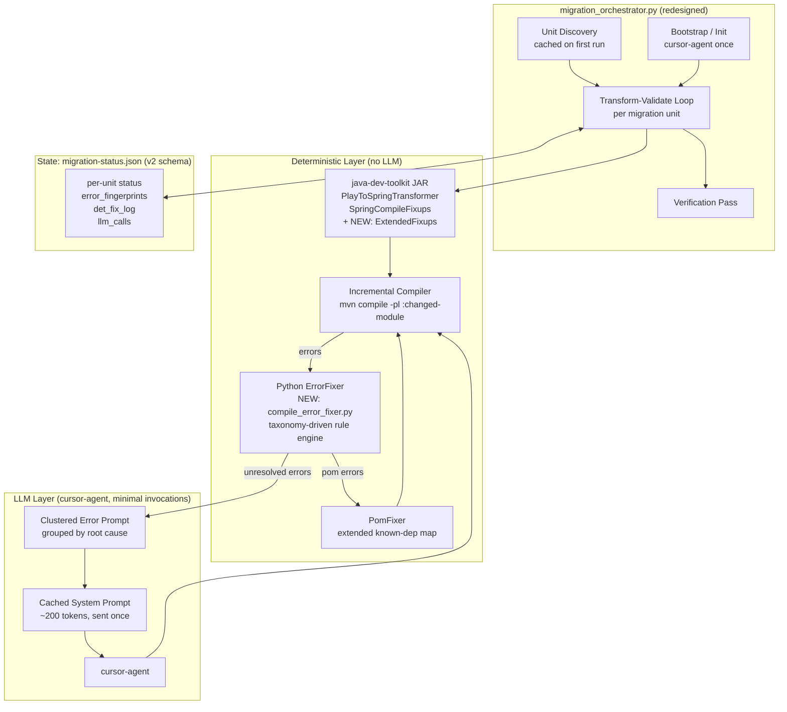
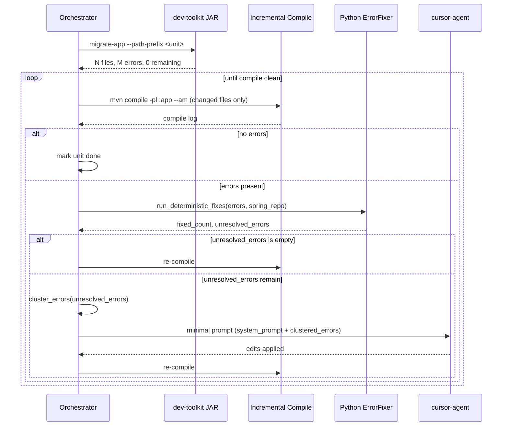
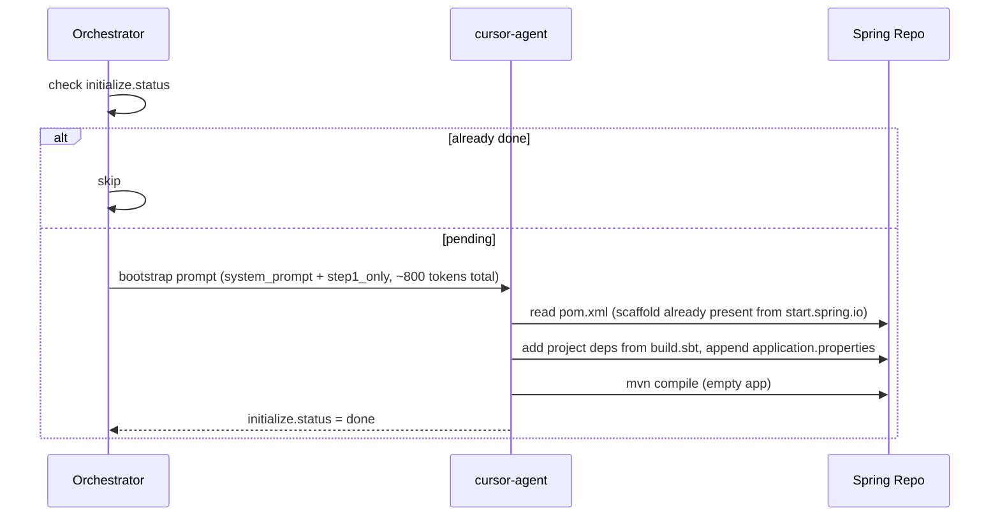

# Design Document: Migration Pipeline Redesign

## Overview

The Play Framework → Spring Boot autonomous migration pipeline currently achieves ~70% deterministic
coverage and wastes significant LLM tokens on repeated boilerplate, undeduped errors, and full-project
recompilation after every small fix. This redesign pushes deterministic coverage to 90%+ by extending
the Java AST toolkit with a new rule engine and adding a Python-side post-compile fixer, while
restructuring prompt architecture to eliminate repeated context and reduce total token usage by ~70%.
cursor-agent is retained as the LLM executor but is invoked only for genuinely ambiguous cases using
minimal, structured, cache-friendly prompts.

---

## Architecture




---

## Sequence Diagrams

### Main Transform-Validate Loop (per migration unit)



### Bootstrap / Init (cursor-agent invoked once)




---

## Components and Interfaces

### Component 1: ExtendedFixups (Java — AST fixups for common Play→Spring patterns)

**Purpose**: Add deterministic AST rewrites to `SpringCompileFixups.apply()` for Play→Spring
patterns that currently require LLM intervention. Target: cover the common injection and
annotation patterns documented in `docs/compile-fixes-for-toolkit.md`.

**Rules to implement**:

```java
// Entry points to add to SpringCompileFixups.apply():
rewriteJavaxInjectProviderToObjectProvider(cu, result);   // javax.inject.Provider<T> → ObjectProvider<T>
rewriteProviderGetToGetObject(cu, result);                // provider.get() → provider.getObject()
rewriteJavaxSingletonToComponent(cu, clazz, result);     // @Singleton on non-controller → @Component
rewriteSendPostSyncAmbiguity(cu, result);                 // disambiguate Map vs JsonNode overloads
rewriteHttpServletRequestAtServiceBoundary(cu, result);  // play.mvc.Http.Request in service params
```

**Interface**:

```java
// Each method follows the static boolean rewriteXxx(CompilationUnit, TransformResult) pattern
static boolean rewriteJavaxInjectProviderToObjectProvider(CompilationUnit cu, TransformResult result);
static boolean rewriteProviderGetToGetObject(CompilationUnit cu, TransformResult result);
static boolean rewriteJavaxSingletonToComponent(CompilationUnit cu, ClassOrInterfaceDeclaration clazz, TransformResult result);
static boolean rewriteSendPostSyncAmbiguity(CompilationUnit cu, TransformResult result);
```

**Responsibilities**:
- Each rewrite is idempotent (check before applying)
- Returns `true` if any change was made (for logging)
- Adds required imports via `ensureImport()`

---

### Component 2: Python ErrorFixer (`compile_error_fixer.py` — new)

**Purpose**: A taxonomy-driven rule engine that runs after `mvn compile` and before any LLM call.
Applies deterministic text/regex fixes to Spring `.java` files for the ~10 known error types.

**Interface**:

```python
class CompileErrorFixer:
    def __init__(self, spring_repo: Path, dry_run: bool = False): ...

    def run(self, errors: list[dict]) -> FixResult:
        """
        Apply all deterministic rules to the given error list.
        Returns count of fixes applied and list of errors that could not be fixed.
        """

    def _fix_missing_import(self, error: dict) -> bool: ...
    def _fix_cannot_find_symbol(self, error: dict) -> bool: ...
    def _fix_wrong_return_type(self, error: dict) -> bool: ...
    def _fix_play_api_remnant(self, error: dict) -> bool: ...
    def _fix_conditional_bean(self, error: dict) -> bool: ...

@dataclass
class FixResult:
    fixed_count: int
    unresolved: list[dict]   # errors that need LLM
    det_fix_log: list[str]   # human-readable log of what was changed
```

**Responsibilities**:
- Parse each error's message against the taxonomy table (see Error Taxonomy section)
- Apply the corresponding text patch to the affected `.java` file
- Track which errors were resolved vs. passed to LLM
- Never modify Play source files

---

### Component 3: Error Clusterer (`error_clusterer.py` — new)

**Purpose**: Group errors by root cause before LLM dispatch. Reduces N separate error objects
to K clusters (K << N), dramatically shrinking prompt size.

**Interface**:

```python
class ErrorClusterer:
    def cluster(self, errors: list[dict]) -> list[ErrorCluster]: ...

@dataclass
class ErrorCluster:
    root_cause: str          # e.g. "missing_import:ObjectMapper"
    representative: dict     # one canonical error for the LLM
    affected_files: list[str]
    count: int
    suggested_fix: str | None  # hint for LLM if known
```

**Clustering rules** (applied in order):
1. Same error message template (strip file/line) → same cluster
2. Same missing symbol name across multiple files → one cluster
3. Same Play API remnant pattern → one cluster

---

### Component 4: Prompt Builder (`prompt_builder.py` — new)

**Purpose**: Construct minimal, structured prompts. Separates static system context (sent once /
cached) from per-call dynamic content (errors only).

**Interface**:

```python
class PromptBuilder:
    def system_prompt(self) -> str:
        """~200 token static context: role, absolute paths, forbidden actions."""

    def fix_prompt(self, clusters: list[ErrorCluster], spring_repo: Path) -> str:
        """
        Per-call prompt: only the clustered errors + affected file snippets.
        No repeated boilerplate. Target: <500 tokens for typical fix round.
        """

    def bootstrap_prompt(self, play_repo: Path, spring_repo: Path,
                         status_path: Path, step1_md: str) -> str:
        """Init-only prompt. Inlines step1_md once; no migrate-app instructions."""
```

**Token budget targets**:
- `system_prompt()`: ≤ 200 tokens
- `fix_prompt()` per cluster: ≤ 50 tokens overhead + error content
- `bootstrap_prompt()`: ≤ 1000 tokens total

---

### Component 5: Incremental Compiler (`incremental_compiler.py` — new)

**Purpose**: Replace full `mvn compile` (entire project) with targeted compilation of only
changed files/modules, reducing compile time on large projects.

**Interface**:

```python
class IncrementalCompiler:
    def __init__(self, spring_repo: Path, dry_run: bool = False): ...

    def compile(self, changed_files: list[Path] | None = None) -> CompileResult:
        """
        If changed_files is provided and project is multi-module, compile only
        the affected module. Falls back to full compile when scope is unclear.
        """

    def _resolve_module(self, file: Path) -> str | None:
        """Return Maven module artifactId for a given source file, or None for single-module."""

@dataclass
class CompileResult:
    returncode: int
    log: str
    errors: list[dict]   # parsed MVN_ERROR_RE matches
    duration_sec: float
```

**Strategy**:
- Single-module projects: always `mvn -q compile` (no change)
- Multi-module: `mvn -q compile -pl :<module> --am` for the module containing changed files
- After LLM edits: full compile once to catch cross-module regressions

---

### Component 6: Compact Skill Files (redesigned markdown)

**Purpose**: Replace prose-heavy skill files with decision-tree format that is ~80% smaller.
The LLM reads less boilerplate and gets to the actionable rules faster.

**Current sizes** (approximate):
- `builder-skill.md`: ~3.5k tokens
- `orchestrator-skill.md`: ~4k tokens
- `transformer-skill.md`: ~1.5k tokens

**Target sizes**:
- `builder-skill.compact.md`: ~700 tokens
- `orchestrator-skill.compact.md`: ~800 tokens
- `transformer-skill.compact.md`: ~400 tokens

**Format** (decision-tree style):

```markdown
# Builder: Init Spring Project

IF initialize.status == done → SKIP

STEPS:
1. Check pom.xml already exists (scaffold from start.spring.io — do NOT regenerate)
2. Read build.sbt → add project-specific deps to existing <dependencies> block
3. Read conf/application.conf → append project keys to application.properties
4. Verify Application.java package matches base_package from workspace.yaml
5. mvn -q compile → fix until clean
6. Set initialize.status = done in migration-status.json

FORBIDDEN: regenerate pom.xml from scratch, migrate-app, Step 2/3 loops
```


---

## Error Taxonomy

The following ~10 error types cover the vast majority of post-transform compile failures.
Each has a deterministic fix that does not require LLM reasoning.

| ID | Error Pattern (regex / keyword) | Root Cause | Deterministic Fix | Owner |
|----|--------------------------------|------------|-------------------|-------|
| E01 | `cannot find symbol.*class ObjectMapper` | Missing Jackson import | Add `import com.fasterxml.jackson.databind.ObjectMapper;` | Python fixer |
| E02 | `cannot find symbol.*class JsonNode` | Missing Jackson import | Add `import com.fasterxml.jackson.databind.JsonNode;` | Python fixer |
| E03 | `package play\.\w+ does not exist` | Play import not removed | Remove matching import line | Python fixer |
| E04 | `cannot find symbol.*method ok\(` | `Results.ok()` remnant | Rewrite to `ResponseEntity.ok(...)` | JAR + Python fixer |
| E05 | `incompatible types.*Result.*ResponseEntity` | Return type not updated | Change method return type to `ResponseEntity<JsonNode>` | JAR + Python fixer |
| E06 | `package javax\.inject does not exist` | javax → jakarta migration | Replace `javax.inject` → `jakarta.inject` in imports | JAR |
| E07 | `cannot find symbol.*class Provider` | `javax.inject.Provider` not rewritten | Replace with `ObjectProvider<T>` + import | JAR (ExtendedFixups) |
| E08 | `package org\.neo4j\.driver\.v1 does not exist` | Neo4j v1 → v5 migration | Replace import prefix | JAR |
| E09 | `cannot find symbol.*method getReasonPhrase` | `HttpStatusCode` API change | Wrap with `instanceof HttpStatus` ternary | JAR |
| E10 | `method .* is already defined` | Duplicate method after transform | Remove duplicate (keep Spring version) | Python fixer |
| E11 | `cannot find symbol.*class RestTemplate` | Missing bean definition | Add `@Bean RestTemplate` config class | Python fixer (generate config) |
| E12 | `incompatible types.*CompletableFuture` | Missing type witness | Add `<ResponseEntity<JsonNode>>` type arg | JAR |

**Clustering key**: errors E01/E02 with the same symbol name across N files → 1 cluster.
Errors E03 with the same Play package → 1 cluster.

---

## Data Models

### migration-status.json v2 Schema

Key changes from v1:
- `errors_history` capped at 5 rounds (was 20) and stores fingerprints only (not full error objects)
- `det_fix_log` per unit: log of deterministic fixes applied
- `prompt_cache_key` in `autonomous`: hash of system prompt for cache invalidation
- `migration_units[].llm_calls` tracks LLM invocations per unit for budget enforcement

```typescript
interface MigrationStatusV2 {
  schema_version: 2;
  current_step: "initialize" | "transform_validate" | "verify" | "done";

  initialize: {
    status: "pending" | "done" | "failed";
    pom_generated: boolean;
    application_java_generated: boolean;
    application_properties_generated: boolean;
    error: string | null;
  };

  source_inventory: SourceInventory | null;

  migration_units: MigrationUnit[];

  // Legacy semantic-layer mode only
  layers: Record<LayerName, LayerEntry>;

  failed_layers: string[];

  autonomous: {
    total_llm_calls: number;
    max_total_llm_calls: number;
    cursor_model: string;
    cursor_model_fix: string;
    cursor_model_escalate: string;
    escalate_after_retries: number;
    max_files_per_cursor_session: number;
    last_errors_path: string | null;
    prompt_cache_key: string | null;   // SHA256 of system_prompt text
  };

  migration_verification: MigrationVerification | null;
}

interface MigrationUnit {
  id: string;
  path_prefix: string;
  java_file_count: number;
  status: "pending" | "in_progress" | "done" | "failed";
  files_migrated: number;
  files_failed: string[];
  validate_iteration: number;
  last_error_count: number | null;
  llm_calls: number;
  // Capped ring buffer of error fingerprints (not full objects)
  error_fingerprints: string[][];   // last 5 rounds, each round is sorted list of "file:line:msg"
  // Log of deterministic fixes applied this unit
  det_fix_log: string[];
  failure_reason: string | null;
  discovered_by: string | null;
}
```

### Backward Compatibility

A `migrate_v1_to_v2()` function handles transparent schema upgrades at orchestrator startup:

```python
def migrate_v1_to_v2(raw: dict) -> dict:
    """
    Upgrade v1 status file to v2 schema in-place.
    - Adds schema_version: 2
    - Renames errors_history → error_fingerprints (truncated to last 5, fingerprints only)
    - Adds det_fix_log: [] to each unit/layer
    - Adds prompt_cache_key: null to autonomous
    """
```

v1 `errors_history` (list of full error dicts) is converted to `error_fingerprints`
(list of sorted signature strings) and truncated to 5 rounds. No data loss for resumability;
the fingerprints are sufficient for loop detection.

---

## Algorithmic Pseudocode

### Main Orchestration Loop

```pascal
ALGORITHM run_migration(play_repo, spring_repo, args)
INPUT: play_repo, spring_repo: Path; args: CLI args
OUTPUT: exit_code: int

BEGIN
  status ← load_or_create_status(spring_repo / "migration-status.json")
  status ← migrate_v1_to_v2(status)

  IF status.current_step = "initialize" AND status.initialize.status ≠ "done" THEN
    ok ← bootstrap_initialize_via_cursor_agent(
           prompt = prompt_builder.bootstrap_prompt(...),  // ~800 tokens, once
           max_attempts = 2)
    IF NOT ok THEN RETURN EXIT_INIT_FAILED
    reset_transform_progress_after_bootstrap(status)
  END IF

  units ← discover_or_load_migration_units(status, play_repo)  // cached after first run
  guardrails ← load_guardrails(args, status)

  FOR each unit IN units WHERE unit.status ≠ "done" DO
    ASSERT guardrails.total_llm_calls ≤ guardrails.max_total_llm_calls

    // 2a. Transform
    migrate_until_done(play_repo, jar, spring_repo, batch_size, path_prefix=unit.path_prefix)
    unit.files_migrated ← result.n

    // 2b. Validate with deterministic-first loop
    exit_code ← validate_unit(unit, spring_repo, guardrails, status, prompt_builder)
    IF exit_code ≠ 0 THEN
      unit.status ← "failed"
      unit.failure_reason ← "stuck"
      CONTINUE
    END IF

    unit.status ← "done"
    atomic_write_json(status_path, status)
  END FOR

  IF all units done THEN
    status.current_step ← "verify"
    status.migration_verification ← run_verification(status, play_repo, spring_repo)
    status.current_step ← "done"
  END IF

  RETURN 0
END
```

**Preconditions**:
- `play_repo` contains `app/` directory with `.java` files
- `spring_repo` exists (created by `setup.sh`)
- `dev-toolkit-*.jar` is present in `play_repo` root

**Postconditions**:
- All migration units have `status = "done"` or `status = "failed"`
- `migration-status.json` reflects final state
- `mvn compile` exits 0 for the Spring project

---

### Deterministic-First Validate Loop

```pascal
ALGORITHM validate_unit(unit, spring_repo, guardrails, status, prompt_builder)
INPUT: unit: MigrationUnit; spring_repo: Path; guardrails: Guardrails
OUTPUT: exit_code: int (0 = clean, 2 = stuck)

BEGIN
  fixer ← CompileErrorFixer(spring_repo)
  compiler ← IncrementalCompiler(spring_repo)
  prev_fingerprints ← last entry of unit.error_fingerprints OR []

  WHILE unit.validate_iteration < guardrails.max_retries_per_layer DO
    result ← compiler.compile(changed_files = last_edited_files)
    unit.validate_iteration ← unit.validate_iteration + 1

    IF result.returncode = 0 THEN
      RETURN 0
    END IF

    // Classify errors
    infra_errors, dep_errors, code_errors ← classify_compile_errors(result.errors)

    IF infra_errors is not empty THEN
      RETURN EXIT_INFRA_ERROR  // JDK/Lombok crash — escalate immediately
    END IF

    // Deterministic pass 1: pom fixes
    IF dep_errors is not empty THEN
      added ← try_deterministic_pom_fix(spring_repo, dep_errors)
      IF added > 0 THEN CONTINUE  // re-compile
    END IF

    // Deterministic pass 2: Python rule engine
    fix_result ← fixer.run(code_errors)
    unit.det_fix_log.extend(fix_result.det_fix_log)

    IF fix_result.fixed_count > 0 AND fix_result.unresolved is empty THEN
      CONTINUE  // re-compile without LLM
    END IF

    // Loop detection on fingerprints
    current_fps ← normalize_errors(fix_result.unresolved)
    IF is_looping(current_fps, unit.error_fingerprints) THEN
      IF unit.llm_calls ≥ guardrails.escalate_after_retries THEN
        RETURN EXIT_STUCK
      END IF
    END IF
    unit.error_fingerprints ← (unit.error_fingerprints + [current_fps])[last 5]

    // LLM pass: only for unresolved errors
    IF guardrails.total_llm_calls ≥ guardrails.max_total_llm_calls THEN
      RETURN EXIT_BUDGET_EXHAUSTED
    END IF

    clusters ← ErrorClusterer().cluster(fix_result.unresolved)
    prompt ← prompt_builder.fix_prompt(clusters, spring_repo)
    // system_prompt sent once per session (cached by cursor-agent)
    call_cursor_agent(model = guardrails.fix_model, prompt = prompt)
    unit.llm_calls ← unit.llm_calls + 1
    guardrails.total_llm_calls ← guardrails.total_llm_calls + 1
  END WHILE

  RETURN EXIT_STUCK
END
```

**Loop Invariant**: `unit.error_fingerprints` contains at most 5 entries; each iteration either
reduces `result.errors` count or increments `unit.llm_calls` toward the escalation threshold.

**Preconditions**:
- `spring_repo` is a valid Maven project
- `fixer` and `compiler` are initialized with the same `spring_repo`

**Postconditions**:
- Returns 0 only when `mvn compile` exits 0
- `unit.det_fix_log` contains a record of all deterministic changes applied
- `unit.error_fingerprints` is updated with the last ≤5 rounds

---

### Error Clustering Algorithm

```pascal
ALGORITHM cluster_errors(errors)
INPUT: errors: list of {file, line, message}
OUTPUT: clusters: list of ErrorCluster

BEGIN
  template_map ← empty map: string → ErrorCluster

  FOR each error IN errors DO
    template ← extract_template(error.message)
    // extract_template: strip file paths, line numbers, quoted identifiers
    // e.g. "cannot find symbol: class ObjectMapper" → "cannot_find_symbol:ObjectMapper"

    IF template IN template_map THEN
      cluster ← template_map[template]
      cluster.count ← cluster.count + 1
      cluster.affected_files.add(error.file)
    ELSE
      cluster ← ErrorCluster(
        root_cause = template,
        representative = error,
        affected_files = [error.file],
        count = 1,
        suggested_fix = lookup_taxonomy_hint(template)
      )
      template_map[template] ← cluster
    END IF
  END FOR

  RETURN sorted(template_map.values(), by = -count)
END
```

**Key**: `extract_template` normalizes messages by:
1. Replacing quoted identifiers with `<SYMBOL>`
2. Replacing file paths with `<FILE>`
3. Replacing line numbers with `<LINE>`
4. Lowercasing

This ensures 10 "cannot find symbol: class ObjectMapper" errors across 10 files → 1 cluster.

---

### Prompt Architecture

```pascal
ALGORITHM build_fix_prompt(clusters, spring_repo)
INPUT: clusters: list of ErrorCluster; spring_repo: Path
OUTPUT: prompt: string (target ≤ 500 tokens for typical round)

BEGIN
  lines ← []

  // Header: what to do (no repeated rules/boilerplate)
  lines.add("Fix these Spring compile errors in " + spring_repo.name + ":")
  lines.add("")

  FOR each cluster IN clusters (up to MAX_CLUSTERS = 5) DO
    lines.add("## " + cluster.root_cause + " (" + cluster.count + " occurrences)")
    lines.add("File: " + cluster.representative.file + ":" + cluster.representative.line)
    lines.add("Error: " + cluster.representative.message)
    IF cluster.suggested_fix is not null THEN
      lines.add("Hint: " + cluster.suggested_fix)
    END IF
    IF cluster.affected_files.size > 1 THEN
      lines.add("Also affects: " + cluster.affected_files[1..3].join(", "))
    END IF
    lines.add("")
  END FOR

  lines.add("Edit only files under " + spring_repo + "/src/main/java/")
  lines.add("Do not modify Play source files.")

  RETURN lines.join("\n")
END
```

**System prompt** (sent once, ~200 tokens, cached):

```pascal
SYSTEM_PROMPT_TEMPLATE = """
You are a Java Spring Boot migration assistant.
Spring repo: {spring_repo}
Play repo: {play_repo} (READ ONLY — never modify)
State file: {status_path}

Rules:
- Edit only {spring_repo}/src/main/java/**
- Preserve business logic verbatim
- Use Spring 6 / Jakarta EE APIs (not javax.*)
- Do not run migrate-app or any dev-toolkit commands
"""
```

This replaces the current approach of inlining full skill markdown (~4k tokens) on every call.


---

## Key Functions with Formal Specifications

### `CompileErrorFixer.run(errors)`

```python
def run(self, errors: list[dict]) -> FixResult
```

**Preconditions**:
- `errors` is a non-empty list of dicts with keys `file`, `line`, `message`
- `self.spring_repo` is a valid directory containing `src/main/java/`
- All `error["file"]` paths are absolute or resolvable relative to `spring_repo`

**Postconditions**:
- `result.fixed_count + len(result.unresolved) == len(errors)` (every error is accounted for)
- Files modified by the fixer are syntactically valid Java (no partial writes)
- `result.det_fix_log` contains one entry per fix applied
- Play source files are never modified

**Loop Invariant** (over taxonomy rules):
- After each rule application, `remaining_errors` is a strict subset of `errors`

---

### `ErrorClusterer.cluster(errors)`

```python
def cluster(self, errors: list[dict]) -> list[ErrorCluster]
```

**Preconditions**:
- `errors` is a list (may be empty)

**Postconditions**:
- `sum(c.count for c in result) == len(errors)` (no errors lost or duplicated)
- Each error appears in exactly one cluster
- Clusters are sorted descending by `count`
- `len(result) <= len(errors)` (clustering never increases count)

---

### `IncrementalCompiler.compile(changed_files)`

```python
def compile(self, changed_files: list[Path] | None = None) -> CompileResult
```

**Preconditions**:
- `self.spring_repo` contains a valid `pom.xml`
- If `changed_files` is provided, all paths are under `spring_repo/src/`

**Postconditions**:
- `result.returncode == 0` iff Maven compilation succeeded
- `result.errors` is empty iff `result.returncode == 0`
- `result.log` contains the full Maven output
- `result.duration_sec > 0`

---

### `migrate_v1_to_v2(raw)`

```python
def migrate_v1_to_v2(raw: dict) -> dict
```

**Preconditions**:
- `raw` is a parsed JSON dict (may be v1 or v2 schema)

**Postconditions**:
- `result["schema_version"] == 2`
- All v1 `errors_history` lists are converted to `error_fingerprints` (list of sorted string lists, max 5 entries)
- All units/layers have `det_fix_log: []` if not present
- `autonomous["prompt_cache_key"]` exists (may be null)
- No existing `status`, `files_migrated`, or `validate_iteration` values are changed

---

## Error Handling

### Scenario 1: Deterministic fixer corrupts a Java file

**Condition**: A regex-based fix produces syntactically invalid Java.

**Response**: The next `mvn compile` will fail with a parse error. The fixer detects this
(error message contains "illegal start of expression" or "reached end of file") and reverts
the file from a backup copy taken before applying fixes.

**Recovery**: The error is moved to `unresolved` and sent to the LLM instead.

**Implementation**: `CompileErrorFixer` writes a `.bak` file before each edit; reverts on
parse-error detection in the subsequent compile round.

---

### Scenario 2: LLM budget exhausted mid-migration

**Condition**: `total_llm_calls >= max_total_llm_calls` with units still pending.

**Response**: The orchestrator marks the current unit as `failed` with `failure_reason = "budget_exhausted"`,
writes state, and exits with code 4. All completed units remain `done`.

**Recovery**: User can increase `MAX_TOTAL_LLM_CALLS` and re-run; the orchestrator resumes
from the first non-done unit.

---

### Scenario 3: Incremental compile misses a cross-module error

**Condition**: A targeted `mvn compile -pl :module` passes but a full compile fails due to
a type mismatch in a different module.

**Response**: After all units in a module are done, the orchestrator runs one full `mvn compile`
as a cross-module validation pass before marking the module group complete.

**Recovery**: Errors from the full compile are fed back into the deterministic-first loop.

---

### Scenario 4: v1 status file with large `errors_history`

**Condition**: Existing `migration-status.json` has units with 20-round `errors_history` arrays
containing full error objects (potentially hundreds of KB).

**Response**: `migrate_v1_to_v2()` converts each `errors_history` to `error_fingerprints`
(sorted string signatures only), retaining only the last 5 rounds.

**Recovery**: Transparent — the orchestrator continues from the existing `status` values.
Loop detection uses the converted fingerprints.

---

## Testing Strategy

### Unit Testing Approach

Each new Python component has a corresponding test module:

- `test_compile_error_fixer.py`: parametrized over all 12 taxonomy entries; verifies fix applied,
  file content correct, backup/revert on bad fix
- `test_error_clusterer.py`: property test — `sum(c.count) == len(input_errors)` for any input
- `test_prompt_builder.py`: token count assertions (system prompt ≤ 200, fix prompt ≤ 500 for
  typical 5-cluster input)
- `test_migrate_v1_to_v2.py`: round-trip test with real v1 status files from the repo

For the Java toolkit:
- `SpringCompileFixupsTest.java`: one test per rewrite rule
- `PlayToSpringTransformerTest.java`: integration test with a file containing `javax.inject.Provider`

### Property-Based Testing Approach

**Property Test Library**: `hypothesis` (Python), `junit-quickcheck` (Java)

Key properties:

```python
# P1: Clustering is lossless
@given(st.lists(error_strategy(), min_size=0, max_size=100))
def test_cluster_lossless(errors):
    clusters = ErrorClusterer().cluster(errors)
    assert sum(c.count for c in clusters) == len(errors)

# P2: Fixer never increases error count
@given(st.lists(error_strategy(), min_size=1, max_size=20))
def test_fixer_monotone(errors, tmp_spring_repo):
    result = CompileErrorFixer(tmp_spring_repo).run(errors)
    assert result.fixed_count + len(result.unresolved) == len(errors)

# P3: v1→v2 migration preserves status fields
@given(v1_status_strategy())
def test_v2_migration_preserves_status(v1_status):
    v2 = migrate_v1_to_v2(v1_status)
    for unit in v2["migration_units"] or []:
        assert unit["status"] == original_status(v1_status, unit["id"])
```

### Integration Testing Approach

End-to-end test using a minimal synthetic Play project (`test/fixtures/mini-play-app/`) with:
- 3 controllers, 2 services, 1 model
- Known compile errors matching taxonomy entries E01, E03, E07

The test runs the full orchestrator in `--dry-run` mode and verifies:
- No LLM calls made (all errors resolved deterministically)
- `migration-status.json` written with correct schema_version: 2
- Token count of generated prompts within budget

---

## Performance Considerations

### Incremental Compilation Savings

For a 200-file project, full `mvn compile` takes ~45s. With incremental compilation targeting
a 20-file unit, expected time is ~8s. Over 15 compile rounds per unit, this saves ~555s per unit.

For a 10-unit project: ~5550s total savings (~92 minutes).

### Token Reduction Analysis

| Source | Current (tokens) | Redesigned (tokens) | Reduction |
|--------|-----------------|---------------------|-----------|
| Bootstrap prompt | ~4500 (full skill × 2) | ~800 (step1 only, once) | 82% |
| Per-fix prompt (boilerplate) | ~2000 | ~200 (system prompt cached) | 90% |
| Error payload (10 errors) | ~1500 (full objects) | ~300 (5 clusters) | 80% |
| Skill files loaded | ~9000 (3 files) | ~1900 (compact versions) | 79% |
| **Total per migration run** | ~50k–100k | ~15k–30k | **~70%** |

### Unit Discovery Caching

`discover_migration_units()` will run `os.walk` on the first orchestrator invocation and cache
the result in `migration-status.json` under `migration_units`. Subsequent runs skip the walk
entirely if all units are already present in the status file.

---

## Security Considerations

- The orchestrator passes absolute paths to cursor-agent. Paths should be resolved with
  `Path.resolve()` before use to prevent directory traversal.
- The `CURSOR_API_KEY` should never be written to `migration-status.json` or logged.
  Subprocess argument logging should redact the key value.
- The Python ErrorFixer writes `.bak` files before editing. These should be cleaned up
  after a successful compile to avoid leaking intermediate state.
- Skill markdown files loaded from disk are not executed; they are only included as
  text in prompts. No `eval()` or dynamic import is involved.

---

## Dependencies

### New Python modules (no new pip dependencies)

- `compile_error_fixer.py` — stdlib only (`re`, `pathlib`, `shutil`)
- `error_clusterer.py` — stdlib only
- `prompt_builder.py` — stdlib only
- `incremental_compiler.py` — stdlib only

### New Java methods (no new Maven dependencies)

- Additional methods in `SpringCompileFixups.java` — uses the JavaParser dependency already in scope
- No new `pom.xml` entries required

### Test dependencies (dev only)

- `hypothesis` (Python property tests): `pip install hypothesis`
- `junit-quickcheck` (Java property tests): add to test scope in `pom.xml`

### Runtime dependencies (unchanged)

- `picocli` — CLI framework for dev-toolkit
- `javaparser-core` — AST manipulation
- `jackson-databind` — JSON in dev-toolkit
- `cursor-agent` CLI — LLM executor


---

## Correctness Properties

*A property is a characteristic or behavior that should hold true across all valid executions of a
system — essentially, a formal statement about what the system should do. Properties serve as the
bridge between human-readable specifications and machine-verifiable correctness guarantees.*

### Property 1: Deterministic-only completion

*For any* Play project whose post-transform compile errors all match taxonomy entries E01–E12,
running the full pipeline should complete without invoking cursor-agent.

**Validates: Requirements 1.1, 1.3**

---

### Property 2: Fixer losslessness

*For any* non-empty list of compile error dicts, `CompileErrorFixer.run()` should return a
`FixResult` where `fixed_count + len(unresolved) == len(errors)` — no error is lost or
double-counted.

**Validates: Requirements 4.1**

---

### Property 3: Fixer never modifies Play source files

*For any* list of compile errors and any Play repository path, after `CompileErrorFixer.run()`
completes, no file under the Play source repository should have been modified.

**Validates: Requirements 4.4**

---

### Property 4: Fixer backup before edit

*For any* Java file that `CompileErrorFixer` modifies, a `.bak` copy of the original file
should exist on disk before the modification is written.

**Validates: Requirements 4.2**

---

### Property 5: Clusterer losslessness

*For any* list of compile error dicts (including the empty list), `ErrorClusterer.cluster()`
should return clusters where `sum(c.count for c in clusters) == len(errors)`.

**Validates: Requirements 5.1, 5.2**

---

### Property 6: Clusterer sort order

*For any* non-empty list of compile errors, the clusters returned by `ErrorClusterer.cluster()`
should be sorted in descending order by `count` — i.e., `clusters[i].count >= clusters[i+1].count`
for all valid `i`.

**Validates: Requirements 5.3**

---

### Property 7: Clusterer same-template grouping

*For any* list of N errors that all share the same normalized message template (same symbol name,
different files/lines), `ErrorClusterer.cluster()` should return exactly one cluster with
`count == N`.

**Validates: Requirements 5.4**

---

### Property 8: System prompt token budget

*For any* valid Spring repo / Play repo / status path configuration, `PromptBuilder.system_prompt()`
should produce a string of at most 200 tokens.

**Validates: Requirements 2.1**

---

### Property 9: Fix prompt token budget

*For any* list of up to 5 `ErrorCluster` objects, `PromptBuilder.fix_prompt()` should produce a
string of at most 500 tokens.

**Validates: Requirements 2.2**

---

### Property 10: ExtendedFixups idempotence

*For any* valid Java source file, applying `SpringCompileFixups.apply()` twice should produce
the same output as applying it once — the second application makes no changes.

**Validates: Requirements 3.4**

---

### Property 11: ExtendedFixups Provider round-trip

*For any* Java source file containing `javax.inject.Provider<T>` field declarations and `.get()`
calls on those fields, after `ExtendedFixups` is applied the file should contain
`ObjectProvider<T>` with the correct import and `.getObject()` calls — and no remaining
`javax.inject.Provider` references.

**Validates: Requirements 3.1, 3.2**

---

### Property 12: v1→v2 migration preserves unit progress

*For any* v1 `migration-status.json` dict, `migrate_v1_to_v2()` should return a dict where
every unit's `status`, `files_migrated`, and `validate_iteration` values are identical to
those in the input.

**Validates: Requirements 8.2**

---

### Property 13: v1→v2 fingerprint conversion is bounded

*For any* v1 status dict where a unit has an `errors_history` list of length L, after
`migrate_v1_to_v2()` the corresponding `error_fingerprints` list should have length
`min(L, 5)` and each entry should be a list of strings (not dicts).

**Validates: Requirements 8.3**

---

### Property 14: Compiler returncode ↔ errors list

*For any* Maven project, `IncrementalCompiler.compile()` should satisfy: `returncode == 0`
if and only if `errors` is empty.

**Validates: Requirements 7.1, 7.2**

---

### Property 15: Resumability — completed units are never re-processed

*For any* `migration-status.json` where a subset of units have `status == "done"`, re-invoking
the orchestrator should leave all `"done"` units unchanged and only process units whose status
is not `"done"`.

**Validates: Requirements 9.4**
