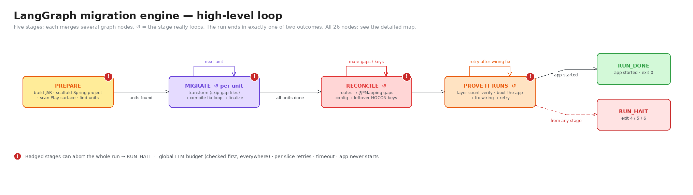

# Play Framework (Java) → Spring Boot

Upgrades a Play Framework (Java) application to Spring Boot.

The default engine is a **LangGraph** state-graph agent (`play-to-spring-kit/agent/`): deterministic steps (JAR transforms, `mvn compile`, config/route diffing) are plain graph nodes; LLM calls are bounded, path-jailed agent nodes whose edits are always verified by the next deterministic node, never by the LLM's own self-report. A legacy Cursor-based orchestrator is still available via `--engine legacy` during the transition.



Full architecture, node-by-node reference, and the detailed diagram: **[docs/langgraph-engine.md](docs/langgraph-engine.md)**.

## Quick start

```bash
chmod +x start_upgrade.sh   # once per clone
cp .env.example .env && $EDITOR .env   # set OPENROUTER_API_KEY
./start_upgrade.sh --play-repo /path/to/your-play-app --spring-repo /path/to/your-spring-repo
```

Nothing runs automatically on clone — `start_upgrade.sh` is the one entry point. It sets up a dedicated venv, picks a JDK 17+, builds `java-dev-toolkit`, and hands off to the chosen engine. See **[.env.example](.env.example)** for the full variable list and **[docs/langgraph-engine.md](docs/langgraph-engine.md#environment-variables)** for defaults and guardrail semantics.

Legacy engine: `--engine legacy` (or `MIGRATION_ENGINE=legacy`), needs `CURSOR_API_KEY` instead. See **[play-to-spring-kit/scripts/README.md](play-to-spring-kit/scripts/README.md)**.

## What lives where

| Directory | Role | Details |
|-----------|------|---------|
| `play-to-spring-kit/agent/` | LangGraph engine (default): graph nodes, LLM agents, deterministic tools. | [docs/langgraph-engine.md](docs/langgraph-engine.md) |
| `play-to-spring-kit/` | Cursor skills, workspace setup, legacy orchestrator. | [play-to-spring-kit/README.md](play-to-spring-kit/README.md) |
| `java-dev-toolkit/` | Maven project building `dev-toolkit-*.jar` — the AST-style transforms both engines call as a subprocess. | [java-dev-toolkit/README.md](java-dev-toolkit/README.md) |

For kit placement when it's not colocated with your Play repo, see [play-to-spring-kit/LOCATION.md](play-to-spring-kit/LOCATION.md).

## Deeper reading

- LangGraph engine — architecture, CLI/env-var reference, resumability, `--interactive`: [docs/langgraph-engine.md](docs/langgraph-engine.md)
- Recurring Play→Spring compile/runtime-wiring fixes: [docs/compile-fixes-for-toolkit.md](docs/compile-fixes-for-toolkit.md)
- Legacy engine architecture: [play-to-spring-kit/docs/legacy/play_to_spring_migration.md](play-to-spring-kit/docs/legacy/play_to_spring_migration.md)
</content>
