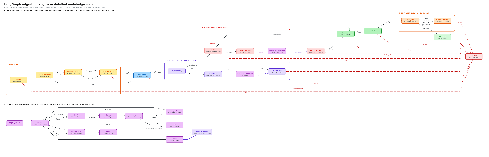

# LangGraph migration engine

`play-to-spring-kit/agent/` is the LangGraph-based rewrite of the Play →
Spring Boot migration orchestrator. It replaces the imperative
`scripts/legacy/migration_orchestrator.py` (the "legacy" engine, still available
via `--engine legacy`) with an explicit state graph: deterministic steps are
plain graph nodes, and LLM calls are bounded, path-jailed agent nodes that
never invoke each other directly — every LLM edit is verified by the next
deterministic node in the graph, never by the LLM's own self-report.

As of **M5**, `start_upgrade.sh` defaults to this engine
(`MIGRATION_ENGINE=langgraph`). This document is the map: what the graph
does, how to run it, how it resumes, and how to use `--interactive` mode.

## Why a rewrite

The legacy orchestrator is a single ~3000-line script: hardcoded phase
order, a `while True` compile-fix loop, hand-rolled resumability via a
`migration-status.json` file it reads and rewrites on every iteration, and
two stateless one-shot `cursor-agent` CLI calls for its only LLM use
(project bootstrap, and residual compile-fix rounds). Routes conversion,
Spring config-key mapping, and runtime wiring were manual gaps — humans did
them by hand, guided by skill markdown.

The LangGraph engine keeps the same guardrails (budget/retry/timeout/loop
detection) and the same JAR-based deterministic tooling
(`java-dev-toolkit`), but:

- Resumability is `SqliteSaver`-backed (checkpoint on every graph step),
  not a JSON file a human or process has to keep consistent.
- LLM calls are OpenRouter-backed (`langchain-openai`), not `cursor-agent`.
- Routes conversion, config-key mapping, and Spring Boot runtime
  verification are automated graph phases (M4), not manual follow-up work.
- Human-in-the-loop is a real `interrupt()`/resume primitive (M5), not "the
  human edits the status file by hand and reruns."

## Quick start

```bash
export OPENROUTER_API_KEY=sk-or-...   # required for LLM rounds; deterministic
                                       # fixers still run without it
./start_upgrade.sh --play-repo /path/to/your-play-app
```

`start_upgrade.sh` defaults to the langgraph engine now. To use the legacy
engine instead (during the transition, or to compare behavior):

```bash
./start_upgrade.sh --engine legacy --play-repo /path/to/your-play-app
# or: MIGRATION_ENGINE=legacy ./start_upgrade.sh --play-repo ...
```

Running the engine directly (bypassing `start_upgrade.sh`'s venv/JDK setup):

```bash
cd play-to-spring-kit
.venv/bin/python -m agent --spring-repo /path/to/spring-repo --play-repo /path/to/play-repo
```

## Architecture

### Package layout

```
play-to-spring-kit/agent/
  cli.py            entry point (python -m agent)
  config.py         AgentConfig — env-var-backed settings, guardrails
  llm.py            OpenRouter ChatOpenAI factory + bounded tool-call loop
  state.py           MigrationState TypedDict, outcome/exit-code tables
  checkpoint.py      SqliteSaver wiring, thread_id derivation
  status_v2.py       migration-status.json v2 dual-write (human-readable
                      artifact) + legacy-status adoption on resume
  graph.py           topology/wiring only (build_graph, RuntimeCtx, recursion_limit)
  nodes/             one module per phase — see below
  agents/            one module per LLM agent (bootstrap, compile_fix, routes,
                      config_mapping, runtime_wiring)
  tools/             deterministic subprocess/parsing wrappers (fs jail,
                      toolkit JAR, toolkit inventory pre-flight scan, HOCON
                      config, routes parsing, Maven boot)
```

`graph.py` only builds and wires the graph — every node/router function
lives in `agent/nodes/*.py`, one module per phase, each exposing either
plain top-level functions (routers that only read `state`) or a
`build(config, ctx) -> dict[str, Callable]` factory (nodes that need
`config`/`ctx`, following the `RuntimeCtx` closure convention below).

### Phases

| Phase | Milestone | Module | What it does |
|---|---|---|---|
| Bootstrap | M3 | `nodes/bootstrap.py` | Scaffolds `pom.xml`/`Application.java`/`application.properties` via a premium-tier LLM agent if they don't already exist; verified deterministically (file existence), never by LLM self-report. |
| Architect | M6 | `nodes/architect.py` | Runs once after inventory, before the first transform. Premium-tier, one-shot LLM decides the Play→Spring mapping and writes `.migration/decisions.md`; every later agent's prompt is told the path, never the contents. Gated by an approval step (`--interactive`) or auto-approved (headless). Skipped entirely with no `play_repo`. |
| Slice pipeline | M2 | `nodes/slice_pipeline.py` | Runs a pre-flight `inventory` scan (Play API surface classified KNOWN/UNKNOWN/PARADIGM, coverage % logged) and discovers migration units from the Play repo, runs `migrate-app` per unit via the JAR (which now skips whole files with a non-KNOWN construct rather than transforming them partially), then the compile-fix loop, then a plausibility check. |
| Compile-fix loop | M1 | `nodes/fix_loop.py` | `compile → det_fix → cluster → guard → agent → compile`. Deterministic fixers (pom dependency inference, known-pattern rewrites) run first; the LLM agent is only reached if they made no progress and the guard (budget/retries/timeout/loop-fingerprint) allows it. `compile` also checks the Play-repo tamper guard first (M6) — any drift halts the run unconditionally. |
| Human gate | M5 | `nodes/human_gate.py` | Sits between a compile's infrastructure-error result and finalizing it. Headless (default): pass-through, same as always. `--interactive`: pauses via `interrupt()` so a human can retry or accept the failure. |
| Signature check (T2) | M6 | `nodes/signature_check.py` | Deterministic, no LLM: diffs Spring method signatures against the Play source, per slice and once more (whole-tree) before boot. Findings are soft — recorded, never gate the run. |
| Routes | M4 | `nodes/routes.py` | Parses the Play `conf/routes` file, diffs against Spring `@*Mapping` annotations already present, and has a cheap-tier LLM agent annotate the gaps (bounded attempts). Writes `.migration/route-map.json`. Non-blocking: always terminates, remaining gaps are recorded, never fails the run. |
| Config mapping | M4 | `nodes/config_mapping.py` | Maps well-known Play HOCON keys to Spring-idiomatic property names (a small seed table, e.g. `mongodb.uri` → `spring.data.mongodb.uri`) deterministically, then a cheap-tier LLM agent for the rest (bounded attempts). Writes `.migration/config-map.json`. Also non-blocking. |
| Boot verification | M4 | `nodes/boot.py` | Actually runs `mvn spring-boot:run` and watches for the Spring Boot startup line within a timeout. If it never starts, a tier-escalating LLM agent (cheap → premium) fixes runtime wiring (missing beans, bad config) and the graph loops back to another boot attempt, up to a budget. **This is the one phase where failure blocks the whole run** — every other M4/M6 phase is best-effort. |
| Endpoint parity (T5) | M6 | `nodes/endpoint_parity.py` | Once the app boots: probes Play vs. Spring endpoints (GET-only) and diffs responses. Pluggable seam — no default dual-boot orchestration is wired in, degrades to `"not_attempted"` without one. Soft finding, never gates the run. |

Architect runs once, after inventory. Routes → config-mapping → boot
verification → endpoint parity run once, after every slice is processed —
not per slice. Signature check runs both per slice and once more,
whole-tree, before boot.

### Node topology

Two diagrams mirror this section visually. Each has a `.png` (preview below) and a matching `.excalidraw` source (edit at [excalidraw.com](https://excalidraw.com) → *Open*, or the VS Code Excalidraw extension):

**Overview** — five stages, left to right (PREPARE → MIGRATE → RECONCILE → PROVE IT RUNS → `RUN_DONE`/`RUN_HALT`), each merging several graph nodes. `↺` marks the stages that genuinely loop; a red `!` badge marks stages that can abort the run, and the run ends in exactly one of the two terminal outcomes. Start here.


**Detailed** — two panels: **A** the main pipeline (all phases, with the shared compile-fix subgraph shown as a reference box at each of its two entry points), **B** the compile-fix subgraph itself, exploded.



Layout is generated by dagre from a graph spec in `docs/diagram-src/` — see the README there to regenerate after changing `build_graph()`. The spec is a hand-maintained mirror of the code, so it drifts if not updated.

The graph has **34 nodes** (plus the `START`/`END` markers LangGraph itself
adds) — up from 26 as of the M6 hardening pass (architect phase, T2
signature checks, Play-repo tamper guard, T5 endpoint parity; see
`docs/superpowers/plans/2026-08-15-plugin-parity-hardening.md`). Every
node/edge below is read directly off `graph.py`'s `build_graph()` — if
you're checking exact routing, that function is the source of truth; this
table and diagram are a map of it, not a reimplementation.

**Note:** the two rendered diagrams below (`.png`/`.excalidraw`) still
reflect the pre-M6 26-node topology and have not been regenerated for this
pass — this table and the edge map are current, the images are not.

| # | Node | Module | Role |
|---|---|---|---|
| 1 | `setup` | `nodes/bootstrap.py` | Builds/installs the `java-dev-toolkit` JAR, runs `setup.sh`, exports Play config. Runs once, first. |
| 2 | `bootstrap_check` | `nodes/bootstrap.py` | Deterministic: do `pom.xml`/`Application.java`/`application.properties` already exist? Decides `skip` vs `agent`. |
| 3 | `bootstrap_agent` | `nodes/bootstrap.py` → `agents/bootstrap.py` | LLM (always premium tier): scaffolds the three files if missing. |
| 4 | `bootstrap_verify` | `nodes/bootstrap.py` | Deterministic re-check of the same three files; loops back to `bootstrap_agent` or gives up after `--max-bootstrap-attempts`. |
| 5 | `inventory` | `nodes/slice_pipeline.py` | Discovers migration units (`discover_migration_units`) **and** runs the toolkit's `inventory` pre-flight scan (`ctx.inventory_runner` → `tools/toolkit_inventory.py`) — classifies every Play construct KNOWN/UNKNOWN/PARADIGM, stores it as `play_surface_inventory`, logs coverage % and any gap constructs at `WARNING` before any file is transformed. |
| 6 | `architect_check` | `nodes/architect.py` | Deterministic: is there a `play_repo` to decide a mapping for? `skip` (no play_repo / resumed run) bypasses the architect entirely, straight to `slice_router`. |
| 7 | `architect_agent` | `nodes/architect.py` → `agents/architect.py` | LLM (always premium tier, one-shot): decides the Play→Spring mapping up front and writes `.migration/decisions.md`. Every later agent's prompt is told this path, never its contents. |
| 8 | `architect_verify` | `nodes/architect.py` | Deterministic: does `.migration/decisions.md` exist and start with the expected first line? Loops back to `architect_agent` or gives up after `--max-architect-attempts`. |
| 9 | `architect_gate` | `nodes/architect.py` | Interactive mode: pauses via `interrupt()` for a human to approve/revise the decision. Headless: auto-approves and logs it (same headless-never-blocks invariant as every other interactive gate). |
| 10 | `slice_router` | `nodes/slice_pipeline.py` | Picks the next non-`done` migration unit, resets per-slice state. |
| 11 | `transform` | `nodes/slice_pipeline.py` | Runs `migrate-app` (`ctx.jar_runner`) for the current unit. As of the pre-flight-inventory work: files containing a non-KNOWN construct (PARADIGM/UNKNOWN) are **skipped entirely** by the toolkit — never written to the Spring tree — and recorded as a `SKIPPED <classification>: ...` warning instead, so the compile-fix loop never inherits a paradigm error it can't fix. |
| 12 | `compile` | `nodes/fix_loop.py` | Runs `mvn compile` (incremental). Entry point to the compile-fix subgraph — also re-entered by any phase's `<phase>_fix_prep` node (generic "fix cycle", below). Also checks the Play-repo tamper guard (`tools/play_guard.py`) first — any drift routes straight to `play_repo_tampered`, bypassing every other outcome. |
| 13 | `human_gate` | `nodes/human_gate.py` | Headless: pass-through to `infra`. `--interactive`: pauses via `interrupt()` for a human retry/abort decision on infrastructure (non-code) compile errors only. |
| 14 | `det_fix` | `nodes/fix_loop.py` | Deterministic fixers (pom dependency inference, known-pattern rewrites) — tried before any LLM call. |
| 15 | `cluster` | `nodes/fix_loop.py` | Groups remaining compile errors into clusters (excluding any signature already shelved by a prior loop-detection round). |
| 16 | `guard` | `guards.py` | The gate: checks global LLM/cost budget, retry cap, timeout, and fingerprint-based loop detection, in that precedence order, before allowing another LLM round. |
| 17 | `agent` | `nodes/fix_loop.py` → `agents/compile_fix.py` | LLM compile-fix round (cheap/premium tier via `choose_model`), only reached if `det_fix` made no progress and `guard` allows it. |
| 18 | `done` | `nodes/fix_loop.py` | Compile succeeded — clean exit from the subgraph. |
| 19 | `infra` | `nodes/fix_loop.py` | Compile failed with an infrastructure (JDK/toolchain) error, not a normal Java error. |
| 20 | `halt` | `nodes/fix_loop.py` | Compile-fix subgraph gave up (budget/retries/timeout/loop) for this slice or fix-cycle. |
| 21 | `play_repo_tampered` | `graph.py` | Terminal: the Play repo (read-only invariant) was modified during the run, or the guard itself couldn't run. Halts unconditionally, bypassing `route_by_phase`. |
| 22 | `slice_finalize` | `nodes/slice_pipeline.py` | Records the slice's outcome (done/failed + reason), checks migrate-app output plausibility. |
| 23 | `signature_check` | `nodes/signature_check.py` | Deterministic T2 tier, no LLM: diffs Spring method signatures against the Play source per slice. Findings accumulate in `state.signature_findings`, never gate the run (soft finding, like routes/config_mapping). |
| 24 | `routes` | `nodes/routes.py` → `agents/routes.py` | Runs once after all slices finish. Diffs Play `conf/routes` against Spring `@*Mapping` annotations; LLM annotates gaps (bounded, self-loops while budget/gaps remain). |
| 25 | `routes_fix_prep` | `nodes/routes.py` | Sets `phase="fix_cycle"`, `fix_cycle_return_to="config_mapping"`, re-enters `compile` to verify the routes agent's edits didn't break the build. |
| 26 | `after_fix_cycle` | `nodes/common.py` | Generic re-entry landing node for **any** phase's fix-cycle (currently only routes uses it) — aborts the run on `budget_exhausted`, otherwise resets `phase` to `"slice"` and hands control to `fix_cycle_return_to`. |
| 27 | `config_mapping` | `nodes/config_mapping.py` → `agents/config_mapping.py` | Deterministic seed-table mapping for well-known HOCON keys, then a bounded LLM round for the rest. Self-loops, non-blocking. |
| 28 | `verify` | `nodes/slice_pipeline.py` | Cross-module layer-count comparison (Play vs. Spring) after all slices + routes + config-mapping are done. |
| 29 | `signature_check_final` | `nodes/signature_check.py` | Unscoped (whole-tree) re-run of the T2 signature check between `verify` and `boot_run` — same soft-finding accumulation as node 23. |
| 30 | `boot_run` | `nodes/boot.py` | Actually runs `mvn spring-boot:run` and watches for the startup line within a timeout. |
| 31 | `runtime_wiring` | `nodes/boot.py` → `agents/runtime_wiring.py` | LLM fixes runtime wiring (missing beans, bad config) when `boot_run` never saw the startup line; tier-escalating, bounded, loops back to `boot_run`. The one M4 phase whose failure blocks the whole run. |
| 32 | `endpoint_parity` | `nodes/endpoint_parity.py` | T5 tier: probes Play vs. Spring endpoints (GET-only) and diffs responses once the app has booted. Degrades to `"not_attempted"` with no runner/play_repo/routes configured — pluggable seam, no default dual-boot orchestration. Never gates the run (soft finding). |
| 33 | `run_done` | `nodes/slice_pipeline.py` | Terminal success — `run_outcome="success"`, exit 0. |
| 34 | `run_halt` | `nodes/slice_pipeline.py` | Terminal non-success — sets `run_outcome`/`run_exit_code` from whatever the run's `run_outcome` already is (or `no_slices`/`slice_failures` if unset). |

Full edge map (mirrors `graph.py`'s module docstring — keep both in sync if routing changes):

```
START -> setup -+-> bootstrap_check -+-> inventory -+-> architect_check -+-> slice_router
                |                     |               |  (no slices ->    |  (skip: no play_repo)
                +-> run_halt          +-> bootstrap_agent -> bootstrap_verify -+  run_halt)  +-> architect_agent -> architect_verify -+-> architect_gate -> slice_router
                    (setup failed)         (loop until scaffolded or exhausted) -> run_halt              (loop until decisions.md written  |
                                                                                                            or exhausted -> run_halt)          +-> run_halt

    slice_router -+-> transform -> compile
                  +-> routes            (all slices done)

    compile -+-> play_repo_tampered --> END                              (Play repo drifted: halts unconditionally)
             +-> done ----------------------> slice_finalize | after_fix_cycle (route_by_phase)
             +-> human_gate -+-> infra -----> slice_finalize | after_fix_cycle (route_by_phase)
             |               +-> compile       (retry, interactive mode only)
             +-> det_fix -+-> compile          (deterministic re-loop)
                          +-> cluster -> guard -+-> agent -> compile
                                                +-> halt --> slice_finalize | after_fix_cycle (route_by_phase)

    slice_finalize -+-> signature_check -> slice_router (continue)
                     +-> run_halt                        (abort: budget/infra/no_llm)

    routes_node -+-> routes_node        (self-loop: more unmapped routes, budget left)
                 +-> routes_fix_prep -> compile   (re-enter compile-fix subgraph, phase=fix_cycle)
                 +-> config_mapping                (no play_repo / no conf/routes: no-op)
                 +-> run_halt                      (routes_node itself hit the global LLM budget)

    after_fix_cycle -+-> <fix_cycle_return_to>  (phase reset to "slice"; non-blocking unless budget_exhausted)
                      +-> run_halt               (budget_exhausted only)

    config_mapping -+-> config_mapping  (self-loop: leftover config keys, budget left)
                     +-> verify          (no leftover / attempts exhausted / no conf-export to map)
                     +-> run_halt        (config_mapping itself hit the global LLM budget)

    verify -+-> signature_check_final -> boot_run
            +-> run_halt

    boot_run -+-> endpoint_parity -> run_done    (app started)
              +-> runtime_wiring                  (app never printed the Spring Boot startup line)

    runtime_wiring -+-> boot_run   (agent round done, re-check boot; always loops back)
                     +-> run_halt  (own budget or global LLM budget exhausted)

    run_done -> END
    run_halt -> END
```

One full pass, in words: `setup` builds the toolkit JAR once → `bootstrap_check`/`bootstrap_agent`/`bootstrap_verify` scaffold the Spring project if it's not there yet → `inventory` scans the Play repo, classifies its API surface, and discovers migration units → `architect_check`/`architect_agent`/`architect_verify`/`architect_gate` decide the Play→Spring mapping once, up front (skipped with no `play_repo`) → `slice_router`/`transform`/`compile`-subgraph/`slice_finalize`/`signature_check` repeats per unit until all are `done` (or the run aborts; `compile` also checks the Play-repo tamper guard every pass) → `routes` then `config_mapping` run once each, best-effort → `verify`/`signature_check_final` cross-check layer counts and signatures → `boot_run`/`runtime_wiring` actually starts the Spring app, looping until it boots or its own budget runs out → `endpoint_parity` probes for response drift → `run_done`/`run_halt`.

### The generic "fix cycle" mechanism

Routes-agent edits are Java changes and can break compilation. Rather than
duplicate the compile-fix loop, any phase that needs to make an edit and
then re-verify it re-enters the *same* `fix_loop` subgraph: it sets
`state["phase"] = "fix_cycle"` and `state["fix_cycle_return_to"]` to the
node it wants control back at once the cycle ends non-fatally, then edges
to `"compile"`. The shared `done`/`infra`/`halt` nodes exit to either
`slice_finalize` (normal slice pipeline) or the single generic
`after_fix_cycle` node (any fix-cycle re-entry) based on `state["phase"]`
alone — adding a new phase costs one line in `after_fix_cycle`'s outgoing
edge map, not a new node or router.

### Guardrails

Same accounting as the legacy orchestrator, enforced by `nodes/common.py`'s
`phase_budget_decision` (shared by routes/config_mapping/runtime_wiring) and
`guards.py` (the M1 compile-fix loop): global LLM call budget
(`MAX_TOTAL_LLM_CALLS`), global dollar budget (`MAX_TOTAL_COST_USD`, opt-in,
M6), per-slice retry cap, wall-clock timeout per slice, and
error-fingerprint loop detection. Budget exhaustion (calls or dollars) is
always checked *before* a phase's own local attempt cap, and always aborts
the whole run (`run_outcome="budget_exhausted"`, exit 4) — it's the one
guardrail with this precedence everywhere. The Play-repo tamper guard (M6)
is the other unconditional halt: any drift in the Play repo during the run
aborts immediately, regardless of phase or budget state.

## CLI reference (`python -m agent`)

| Flag | Default | Notes |
|---|---|---|
| `--spring-repo PATH` | *(required)* | Target Spring Boot project. |
| `--play-repo PATH` | none | Source Play project. Omit to run standalone against an already-scaffolded Spring repo (treats it as one slice; skips routes/config-mapping, which need a Play repo). |
| `--slice-id ID` | `default` | Label for standalone/single-slice runs. |
| `--dry-run` | off | No subprocess/file-writing side effects; deterministic tools log what they would do. |
| `--fresh` | off | Ignore any existing checkpoint (new thread_id) **and** skip legacy `migration-status.json` adoption — a genuinely blank slate. |
| `--interactive` | off | Pause on infrastructure compile errors for a human decision instead of finalizing immediately (see below). |
| `--verbose`, `-v` | off | Debug-level logging. |
| `--workspace PATH` | parent of `--play-repo` | Passed to `setup.sh`. |
| `--spring-name NAME` | none | Passed to `setup.sh`. |
| `--toolkit-root PATH` | sibling `java-dev-toolkit/` | Override the dev-toolkit source location. |
| `--skip-build-toolkit` | off | Require an existing JAR under `play-to-spring-kit/lib/` instead of building it. |
| `--export-play-conf` | off | Flatten `conf/application.conf` into `application.properties` during setup (feeds the config-mapping phase). |
| `--conf-strip-prefix PREFIX` | `[]` (repeatable) | Extra HOCON prefixes to drop during conf export (e.g. `akka.` is always stripped). |
| `--max-bootstrap-attempts N` | `2` | Bootstrap agent retry cap. |

### Environment variables

| Variable | Default | Purpose |
|---|---|---|
| `OPENROUTER_API_KEY` | *(none)* | Required for any LLM round. Without it, deterministic fixers still run; LLM-gated phases resolve to `no_llm`/skip gracefully rather than crashing. |
| `OPENROUTER_BASE_URL` | `https://openrouter.ai/api/v1` | Any OpenAI-compatible endpoint works. |
| `MIGRATION_MODEL_CHEAP` | `anthropic/claude-haiku-4.5` | First-tier model (compile-fix, routes, config-mapping, runtime-wiring, before either escalation threshold is crossed). |
| `MIGRATION_MODEL_PREMIUM` | `anthropic/claude-sonnet-4.5` | Escalation tier. Always used for bootstrap (one-shot, high-stakes scaffold — never routed). For compile-fix, routes, config-mapping, and runtime-wiring, `AgentConfig.choose_model` picks this tier once either `ESCALATE_AFTER_RETRIES` or `MIGRATION_ESCALATE_ITEM_THRESHOLD` is crossed (see below) — whichever fires first. |
| `LLM_TIMEOUT_SEC` | `600` | Per-request timeout. |
| `MAX_TOTAL_LLM_CALLS` | `50` | Global run budget — the one guardrail that always aborts the whole run when exhausted. |
| `MAX_RETRIES_PER_LAYER` | `5` | Per-slice compile-fix retry cap. |
| `TIMEOUT_PER_LAYER_MINS` | `30` | Per-slice wall-clock timeout. |
| `ESCALATE_AFTER_RETRIES` | `2` | Retries before switching cheap → premium tier. |
| `MIGRATION_ESCALATE_ITEM_THRESHOLD` | `5` | Alternate escalation trigger: switches cheap → premium when a round's task size (error-cluster count for compile-fix, unmapped-route count for routes, leftover-key count for config-mapping, distinct `Caused by:` count for runtime-wiring) reaches this value, even on attempt 1. Note: routes/config-mapping pass the *full* remaining-work count each round (not a per-slice batch), so real apps with more than this many unmapped routes or leftover config keys will escalate those two phases to premium on attempt 1 by default — lower this or raise it depending on your cost/quality tradeoff. |
| `MAX_AGENT_TOOL_CALLS` | `8` | Tool-call cap per LLM round. |
| `MAX_AGENT_CONTEXT_TOKENS` | `50000` | Context-budget threshold (input tokens) before `run_tool_loop` auto-compacts (headless) or asks once via `interrupt()` (`--interactive`). |

## Resumability

`SqliteSaver` at `<spring-repo>/.migration/langgraph-checkpoints.sqlite` is
the source of truth, keyed by `thread_id = sha1(spring_repo path)`. Rerun
the exact same command and the graph resumes from its last checkpoint — no
repeated JAR invocations or LLM calls for work already done.

`migration-status.json` (`<spring-repo>/migration-status.json`, repo root —
not under `.migration/`) is a **derived, human-readable artifact** written
after every run for people/tools reading it — never read back to resume a
run once a checkpoint exists.

### LLM call logs

Every `run_tool_loop` call (bootstrap, compile-fix, routes, config-mapping,
runtime-wiring) writes two things, neither gated by `--verbose`:

- Console (`agent.llm` logger, `INFO` — visible by default): one line per
  round/tool-call, tagged `[<phase>/<request_id>]` (e.g.
  `[bootstrap/c1f7a6ce]`) so every line from one `run_tool_loop` call shares
  the same `request_id`. Includes model, token counts, tool name, and for
  `read_file`/`write_file`/`str_replace` the `path` being touched. The first
  line of each call also prints the debug file path (below). Kept short —
  no full prompt/tool-output text on stdout.
- `<spring-repo>/.migration/llm-debug.jsonl` — one JSON record per
  round/tool-call with the **full** system/user prompt, tool call args, and
  tool output, tagged with the same `request_id` as the console lines
  (`grep <request_id> llm-debug.jsonl` pulls the full detail behind one
  console line). Also has `finish` / `cap_reached` events explaining why a
  loop stopped.
- `<spring-repo>/.migration/llm-usage.jsonl` — one summary record per agent
  attempt (model, llm_requests, tool_calls, tokens, compactions); unrelated
  to `request_id`, already existed before the per-round logging above.

`llm-debug.jsonl` necessarily contains full Spring source file contents (the
same content the tool loop already sent to the LLM API via `read_file` —
there's no way to have an editing agent reason about code without that,
inherent to every file-editing LLM agent). `setup.sh` appends `.migration/`
to `<spring-repo>/.gitignore` (creating it if missing) so this never lands in
the customer's Spring repo's git history.

### Adopting a legacy run

If you have a `migration-status.json` from a **legacy-engine** run (or from
a langgraph run whose checkpoint was lost) and no sqlite checkpoint exists
yet for this `spring_repo`, the langgraph engine adopts it automatically:
`migration_units` (with per-unit progress), `source_inventory`,
`migration_verification`, and the accumulated `total_llm_calls` count are
seeded into the initial state, so already-`done` units are skipped and the
run picks up where the legacy engine left off — including, for the first
time, running the M4 phases (routes/config-mapping/boot verification) that
the legacy engine never had. Pass `--fresh` to skip adoption and start
completely clean instead.

## `--interactive` / human-in-the-loop

Without `--interactive` (the default), an infrastructure compile error
(JDK/toolchain crash, not a normal Java error) finalizes the run
immediately with `outcome=infrastructure_error`, exit 5 — same as the
legacy engine.

With `--interactive`, the same failure instead pauses the run and prints
the failure's log tail, then prompts:

```
Compile hit an infrastructure error. Retry, or accept as a hard failure? [retry/abort]:
```

- `retry` loops back to `compile` (useful if it looked like a transient
  toolchain hiccup).
- anything else (including unrecognized input) finalizes as
  `infrastructure_error`, same as headless.

If the terminal session drops or you hit Ctrl-D/Ctrl-C at the prompt, the
CLI exits cleanly with code `130` and a message confirming the run is
**safely paused and resumable** — just rerun the exact same command. The
CLI detects a pending interrupt on startup and resumes it rather than
restarting the graph from scratch.

## Exit codes

| Code | Meaning |
|---|---|
| 0 | Success. |
| 1 | Generic failure (setup failed, unhandled recursion-limit backstop). |
| 2 | No LLM available (`OPENROUTER_API_KEY` unset) and deterministic fixers got stuck. |
| 3 | Bootstrap init never completed after `--max-bootstrap-attempts`. |
| 4 | Global LLM call budget exhausted (`MAX_TOTAL_LLM_CALLS`) — the one outcome that always aborts immediately, at any phase. |
| 5 | A slice failed terminally, an infrastructure compile error occurred, or runtime wiring never got the app to start within its budget. |
| 6 | No migration units discovered. |
| 130 | (`--interactive` only) Paused awaiting a human decision — not a failure; rerun to resume. |

## What's still manual

- `docs/compile-fixes-for-toolkit.md` remains the living reference for
  recurring Play→Spring compile and runtime-wiring fixes — the
  `runtime_wiring` agent's prompt is distilled from its "Spring Boot
  runtime" section; update that doc, not the agent's prompt, when a new
  recurring pattern is found.
- A soak run against a real, non-trivial Play repository (beyond the test
  fixtures under `agent/tests/fixtures/`) has not been performed as part of
  this milestone — do that before fully retiring the legacy engine.
